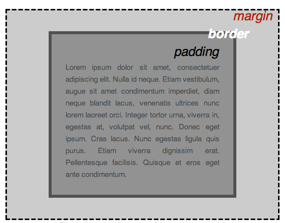

# CSS（Cascading Style Sheets）

CSS 是一种样式表语言，用来描述 `HTML` 或 `XML`（包括如 SVG、MathML 或 XHTML 之类的 XML 分支语言）文档的呈现方式。

```css
p {
  color: red;
  width: 500px;
  border: 1px solid black;
}
```

上述代码的整个结构被称为规则集（Ruleset）。

- `p` 被称为选择器（Selector）。
- 大括号中以 `;`（Semicolon）分隔的每一行称为一个声明（Declaration）。
- 第一个声明中的 `color` 被称为属性（Property）。
- 第一个声明中的 `red` 被称为属性值（Property Value）。
- 属性和属性值中间以 `:`（Colon）分隔。

## 注释

在 `/*` 和 `*/` 之间的内容都是注释。

## 元素类型

- Non-replaced elements：没有被外部资源替换的、HTML 自己的内容元素。
    - `<span>`
    - `<a>`
    - `<strong>`
    - `<em>`
    - `<code>`
    - `<div>`
    - `<p>`
- Replaced elements：内容是由外部资源替换进来的，比如：图片或视频文件。
    - ``
    - `<video>`
    - `<iframe>`
    - `<embed>`
    - `<fencedframe>`

## 将 CSS 应用于 HTML

- 外部样式表
    - 是一个 `.css` 结尾的文件。
    - 添加 `<link rel="stylesheet" href="styles.css" />` 到 `<head>` 标签中。
- 内部样式表
    - 是一个 `<style>` 标签。
    - 也需要放在 `<head>` 中，这样 CSS 在页面渲染前加载，可以避免无样式内容闪烁（FOUC，即：Flash of unstyled content）。
- 行内样式
    - 是 HTML 元素上的 `style` 属性。
    - `style` 属性中的多个声明以分号（`;`）分隔。

### 选择器（Selector）

选择器直接相连不加空格就代表的是 `and` 关系。即同时拥有 `.alert` 和 `.stop` 的元素才生效可以写成：

```css
.alert.stop {
  color: red;
  font-weight: bold;
}
```

#### 简单选择器

多个选择器共用同一个声明时，这些选择器被称为选择器列表（Selector Lists）。

```css
p,
.my-class,
#my-id {
  color: red;
}
```

多个 **selector** 之间以 comma（`,`）分隔。

- 上述例子中的 `p` 是元素选择器（Type Selector）。
- `.my-class` 是类选择器（Class Selector）。
- `#my-id` 是 ID 选择器（ID Selector）。ID 选择器是大小写敏感的。

注意：在选择器列表中，如果一个选择器的写法出现了错误（比如：类选择器写成了 `..my-class`），那么整个选择器列表中的所有选择器都会失效。

##### 通用选择器

通用选择器匹配文档中的所有元素。

```css
* {
  margin: 0;
  padding: 0;
}
```

上述例子会给重置掉所有元素的 `margin` 和 `padding` 属性，通常用于去掉浏览器附加的默认值。

注意:

- 通用选择器性能相对低下，在大项目里尽量不要频繁滥用。
- 更常见的场景是配合其他选择器限定范围（如 `div *`，`ul > *`），而不是单独使用 `*`。

#### [属性选择器](https://developer.mozilla.org/en-US/docs/Web/CSS/Attribute_selectors)

##### 存在选择器和值选择器

- `[attr]`：`a[title]` 会选择所有拥有 `title` 属性的 `a` 元素。
- `[attr=value]`：`a[href="https://example.com"]` 会选择所有拥有 `href` 属性且值为 `"https://example.com"` 的 `a` 元素。
- `[attr~=value]`：`p[class~="special"]` 会选择所有拥有 `class` 属性且该属性值为 `special` 或包含 `special` 的 `p` 元素。注意此处的包含是指包含一个**独立的、完整**的单词，这个单词必须用**空格**与其他部分隔开。
- `[attr|=value]`：`div[lang|="zh"]` 会选择所有拥有 `lang` 属性且值为 `zh` 或以 `zh-` 开头的 `div` 元素。此处注意 `zh` 后面的**连字符**。

##### 子串匹配选择器

- `[attr^=value]`：`li[class^="box"]` 会选择所有拥有 `class` 属性且该属性值以 `box` 开头的 `li` 元素。与 `[attr|=value]` 不同的是，此处不要求 `box` 后面必须跟连字符，后面跟任意字符串都是可以的。
- `[attr$=value]`：`li[class$="box"]` 会选择所有拥有 `class` 属性且该属性值以 `box` 结尾的 `li` 元素，匹配时区分大小写。
- `[attr*=value]`：`li[class*="box"]` 会选择所有拥有 `class` 属性且该属性值在任意位置包含 `box` 字符串的 `li` 元素。

#### [伪类选择器](https://developer.mozilla.org/en-US/docs/Web/CSS/Pseudo-classes)

伪类（Pseudo-classes）选择器可以给元素的不同状态设置不同的样式。

##### `:first-child`

- `:first-child`：浏览器会遍历文档中的每一个元素，检查它是否是它父元素的第一个子元素。
- `p:first-child`：选择**并且仅当**这个第一个子元素是一个 `<p>` 标签。
    - 浏览器会遍历文档中的每一个 `<p>` 元素，然后判断该 `<p>` 元素是否是它父元素的第一个子元素。
    - 该选择器常被误认为是选择父元素内的第一个 `p` 元素。
- `article p:first-child`：选择在 `<article>` 元素内的、作为其直接父元素第一个子元素的 `<p>` 元素。即浏览器会找到文档中所有的 `<article>` 元素，在每个 `<article>` 内部，找到第一个 `<p>` 元素。

##### `:nth-*`

- `:nth-child()` 伪类选择器用于选择父元素内的第 n 个子元素。它是基于所有子节点的顺序来计数的。
    - `:nth-child()` 接受一个参数，这个参数用于描述一个用于匹配同级元素列表中元素索引的模式。索引从 `1` 开始。该参数的常见取值如下：
        - 关键字。
            - `odd`。
            - `even`。
        - `<An+B>`。
            - `A` 是一个整型的步长。
            - `B` 是一个整形的偏移量。
            - `n` 是一个非负整数，从 `0` 开始。
        - `of <selector>` 语法。
            - 当传递一个选择器参数时，将会匹配第 n 个匹配这个选择器的元素。
            - `:nth-child(-n + 3 of li.important)`：在同级元素中，只考虑那些匹配 `li.important` 的兄弟节点，然后在这些节点中选取前 3 个。
            - `li.important:nth-child(-n + 3)`：选中那些既是第 1~3 个子节点、又具有类名 `important` 且是 `<li>` 元素的节点。
- `:nth-last-child()` 的所有特性和 `:nth-child()` 完全一致，唯一不同的就是 `:nth-last-child()` **从后往前计数元素**。
- `:nth-of-type()` 伪类选择器用于选择父元素内特定类型的第 n 个子元素。它的核心特点是**只在同一类型的元素兄弟节点中计数**。
- `:nth-last-of-type()` 是 `:nth-of-type()` 的反向版本。它的核心特点是**从最后一个相同类型的兄弟元素开始数。**。

注意：

- `tr :nth-child(1)`：表示选中 `tr` 内部的第一个元素。这里 `tr` 元素选择器和 `:nth-child(1)` 伪类选择器之间是空格，空格代表后代选择器。
- `tr:nth-child(1)`：表示选中第一个 `tr` 本身。这里 `tr` 元素选择器和 `:nth-child(1)` 伪类选择器之间没有空格，因此是整个选择器是复合选择器。
- 在 `element:nth-child()` 这种语法中，浏览器在计算“第几个孩子”时，会把所有类型的子元素都算进去。但是只有当那个位置的元素类型和选择器里的 `element` 匹配时，才真正算命中。
- 如果没有在 `:nth-of-type()` 前面加具体元素选择器（比如：`:nth-of-type(2)`），那么它的匹配行为是**匹配任意类型（即所有标签）中，属于其类型序列的第 n 个子元素的元素。**

##### 用户行为伪类

```css
a:link {
  color: pink;
}

a:visited {
  color: green;
}

a:hover {
  text-decoration: none;
}

a:active {
  color: orange;
}

a:focus {
  text-decoration: none;
}
```

- 上述的代码给**未访问**过的链接设置为红色。
- **已访问**链接的颜色设置为绿色。
    - 当链接的 `href` 指向的 URL 在 浏览器的历史记录中存在时，该链接会被认为是“已访问（visited）的”。它和当前页面是否还开着无关，完全依赖于浏览器的历史记录。
    - 只有手动清除浏览器关于该链接的历史记录才能从已访问状态回到未访问状态。
- **鼠标悬停**在链接上时去掉链接的下划线。
- **点击按下的瞬间**颜色设置为橘色。
- 链接**获得焦点**时去掉链接的下划线。

#### [伪元素选择器](https://developer.mozilla.org/en-US/docs/Web/CSS/Pseudo-elements)

伪元素（Pseudo-elements）是一种特殊的选择器，用来选中元素中不存在的“虚拟部分”，然后对这些部分进行样式设置。它以双冒号（`::`）开头。

- `::before`：在元素内容之前插入生成的内容。必须配合 `content` 属性一起使用，否则伪元素不会显示。

    ```html
    <p class="box">Content in the box in my HTML page.</p>
    ```

    ```css
    .box::before {
      content: "This should show before the other content. ";
      background-color: yellow;
    }
    ```

- `::after`：在元素内容之后插入生成的内容。
- `::first-line`：选择文本的第一行。
- `::first-letter`：选择文本的第一个字母。
- `::selection`：选中（高亮）文本时应用样式。
- `::marker`：选中列表项前的项目符号或编号。
- `::placeholder`：选中 `<input>` 或 `<textarea>` 的占位文本。

#### 组合器选择器

```css
/* 后代选择器：选中 <li> 内部的所有的 <em> 标签，无论嵌套多少层。*/
li em {
  color: rebeccapurple;
}

/* 子选择器：选中所有 <div> 元素的直接子元素的 <p> 标签。*/
div > p {
  color: blue;
}

/* 相邻兄弟选择器：选中第一个和 <h1> 同级并且位于 <h1> 后面的 <p> 标签。*/
h1 + p {
  font-size: 200%;
}

/* 通用兄弟选择器：选中所有和 <h1> 同级并且位于 <h1> 后面的 <p> 标签。*/
h1 ~ p {
  font-size: 200%;
}
```

- `' '`：后代选择器（Descendant Combinator）。
- `'>'`：子选择器（Child Combinator）。
- `'+'`：相邻兄弟选择器（Adjacent Sibling Combinator）。
- `'~'`：通用兄弟选择器（General Sibling Combinator）。

## 字体/文本（Text/Font）

### 字体（Font）

**Web safe fonts**（网页安全字体）指的是在大多数操作系统和设备上都自带安装、无需额外下载的字体。因为它们几乎可以保证在不同平台上正常显示，所以叫 “web safe”。

#### `font-family` 属性

`font-family` 属性的值是按顺序写的多个字体名称，浏览器会依次寻找能用的字体，找到第一个可用的就用它。**通用字体族**通常写在最后作为兜底。下方例子中 `'Times New Roman'` 和 `Helvetica` 是字体名称，`sans-serif` 是通用字体族。`'Times New Roman'` 是带空格的字体，使用时必须加引号。

```css
body {
font-family: 'Times New Roman', Helvetica, sans-serif;
}
```

常见的通用字体族以及对应的网页安全字体如下：

- `serif`：有衬线字体
    - Times New Roman
    - Georgia
    - Garamond
    - Palatino Linotype / Book Antiqua
- `sans-serif`：无衬线字体
    - Arial
    - Helvetica
    - Verdana
    - Tahoma
    - Trebuchet MS
    - Geneva
- `monospace`：等宽字体
    - Courier New
    - Lucida Console
    - Monaco
- `cursive`：手写体
    - Comic Sans
    - Comic Sans MS
- `fantasy`：装饰性字体
    - Brush Script MT

#### `font-size` 属性

CSS 中的 px（像素）是一个绝对长度单位，它定义为 1/96 英寸，因此 16px 在不同屏幕上显示的视觉大小是一致的。

- **PPI**（Pixels Per Inch）：每英寸像素数（物理像素密度）是每英寸所包含的像素数量，每英寸像素值越高，屏幕能显示的图像越精细。
- **DPR**（Device Pixel Ratio）设备像素比是 1 个 CSS 像素对应多少个物理像素。**浏览器缩放**会动态改变 CSS 像素与物理像素的映射关系，从而改变 DPR。

    ```js
    value = window.devicePixelRatio
    console.log(value)
    ```

- 在 PPI 为 2 的屏幕上，1 个 CSS 像素会对应 2*2=4 个物理像素点，对于高度 16 CSS 像素 × 2 = 32 物理像素，因此 16px **大约**会占用 32 个物理像素的高度。这里的大约是因为**字体渲染并不是严格的方块像素堆积**，字体有轮廓曲线，渲染引擎会用抗锯齿、亚像素渲染等手段来进行优化。

注意：

- `font-size` 属性真正控制的是字体的标准高度（全方高度），当 `font-size` 改变时，整个字体字形被等比例放大或缩小。字体的宽度并不是独立变化的，它遵循一个核心原则：**保持字体的原始比例**。
- `font-size` 的值如果是以 `em` 为单位，那么此时参照对象是父元素的 `font-size`。其他属性，如：`width/height`、`padding/margin`、`line-height`、`text-indent` 等使用相对长度时的参照对象是当前元素的 `font-size`。
- 多数浏览器的 `<html>` 元素默认的 `font-size` 是 16px。
- Chrome 开发者工具中的的盒模型图示中显示属性值的是底层渲染引擎实际使用的、可能经过调整的精确值。这与在 CSS 中声明的属性值可能不一致。可能是你的系统或浏览器显示缩放不是 100%。

#### `font-weight` 属性

`font-weight` 是 CSS 用来设置字体粗细的属性。它的值既可以是关键字也可以是数值：

- 关键字
    - `normal`：标准字重（相当于 400）。
    - `bold`：粗体（相当于 700）。
    - `bolder`：比父元素字体更粗（相对值）。
    - `lighter`：比父元素字体更细（相对值）。
- 数值
    - 范围：`100` ~ `900`
    - 间隔：通常是每 100 一个级别
    - 越小越细，越大越粗
        - `100`：Thin
        - `200`：Extra Light (Ultra Light)
        - `300`：Light
        - `400`：Normal
        - `500`：Medium
        - `600`：Semi Bold (Demi Bold)
        - `700`：Bold
        - `800`：Extra Bold (Ultra Bold)
        - `900`：Black (Heavy)

注意：不是所有字体都提供这么多粗细，大部分常见字体只支持 `400` 和 `700`（比如 Arial）。如果字体本身没有对应的字重，浏览器会用最接近的粗细来代替。

#### `font-style` 属性

`font-style` 是 CSS 中用来设置字体样式的属性，主要控制文字是否倾斜。常见取值如下：

- `normal`：默认值，字体正常显示，不倾斜。
- `italic`：使用字体的斜体字形，注意这里的斜体字形是字体设计师提前设计好的，笔画可能会有变化，并不只是简单地倾斜。
- `oblique`：强制让字体倾斜显示（即机械地把正体字倾斜一定角度）。
- `oblique <angle>`：可以指定倾斜角度。如：`oblique 10deg`。

#### 加载第三方字体

以 [Google Fonts](https://fonts.google.com/) 为例:

- 选择你喜欢的字体。
- 在详情页点击 "Get font" 按钮。
- 在下一页中点击 "Get embed code" 按钮。
- 复制代码放入 `<head> </head>` 标签中。

中国大陆地区建议先下载字体文件，再导入到项目中自行维护。

### 文本（Text）

#### `color` 属性

- `color` 属性专门用来设置文本的前景色（即字体颜色）。
- 应用到 `<p>` 元素时，会影响该段落里所有的文字内容。
- 注意：`color` 是 可继承属性，如果父元素设置了 `color`，子元素默认会继承。

#### `text-align` 属性

决定行内内容（文字、行内元素、行内块元素）的水平对齐方式。常见取值如下：

- `left`：左对齐（默认，大多数语言用这个）。
- `right`：右对齐（阿拉伯语等从右到左语言常用）。
- `center`：居中对齐。
- `justify`：两端对齐（调整单词间或字间距，让左右对齐，看起来像报纸排版）。
- `start` / `end`：根据书写方向自动选择（现代浏览器更推荐）。

#### `text-decoration` 属性

```css
text-decoration: <line> || <style> || <color> || <thickness>;
```

上述代码中的 `||` 表示这些属性值可以以任意顺序出现在简写中。

- `text-decoration-line`：指定哪种线（或多种线）要绘制，下面的这些值是可以组合的。
    - `underline`
    - `overline`
    - `line-through`
    - `none`
- `text-decoration-style`：指定线的样式。
    - `solid`
    - `double`
    - `dotted`
    - `dashed`
    - `wavy`
- `text-decoration-color`
    - 任意颜色（`#hex`、`rgb()`、`currentColor` 等）。
    - 如果未显式设置，装饰线通常采用 `currentColor`（即：文本颜色）。
- `text-decoration-thickness`：控制装饰线的粗细。
    - `auto`
    - `from-font`
    - 长度或百分比。

#### `text-shadow` 属性

用于给文字添加阴影效果，既能实现细微的文字立体感，也能打造出发光、模糊、炫彩等效果。

```css
text-shadow: offset-x offset-y blur-radius color;
```

- `offset-x`：阴影在水平方向上的偏移量。
    - 正值：向右偏移。
    - 负值：向左偏移。
- `offset-y`：阴影在垂直方向上的偏移量。
    - 正值：向下偏移。
    - 负值：向上偏移。
- `blur-radius`（可选）：模糊半径。
    - 0 表示阴影边缘清晰。
    - 数值越大，阴影越模糊、越柔和。
- `color`（可选）：阴影颜色。可以使用 red、#ff0000、rgba(0,0,0,0.5) 等。

可以一次性定义多个阴影，用逗号分隔，类似 Photoshop 的图层叠加：

```css
h1 {
  text-shadow:
    2px 2px 2px black,   /* 黑色阴影 */
    -2px -2px 2px gray;  /* 灰色阴影 */
}
```

应用场景如下：

- 文字立体效果：用不同方向的阴影增加层次感。
- 发光效果：使用 `blur-radius` 和亮色。
- 描边效果：利用多个方向的阴影模拟描边。

#### `line-height` 属性

用于设置行框的高度，即两行文本基线之间的距离。常见取值如下：

- `normal`：`line-height: normal;` 浏览器的默认值。具体数值由浏览器和字体族决定。
- 数值：`line-height: 1.5;` 表示相对于当前元素的 `font-size` 的倍数。
    - 具有继承性时，子元素会继承这个倍数，并根据自己的字体大小计算行高，不会产生意外的重叠问题。
- 长度值：`line-height: 24px;` 或者 `line-height: 1.5em;`（效果上等同于 `line-height: 1.5`）
    - 当使用 `em` 并发生继承时，子元素继承的是计算后的固定值，而不是比例，可能导致子元素字体变大时行高不够用。
- `percentage`：相对于当前元素的 `font-size` 进行计算。`line-height: 150%` 效果上等同于 `line-height: 1.5`。
    - 和 `em` 一样，存在继承问题。子元素继承的是计算后的固定值。

行内元素的 `width` 和 `height` 不会改变实际的盒子尺寸，因此 `span` 元素中文字的高度由 `line-height` 属性决定。

#### `letter-spacing` 属性

用于控制字符之间的水平间距。常见取值如下：

- `normal`：默认字距（由字体自身决定）。
- 长度值：可以是固定像素，也可以是 `±0.02em` 这样的相对值，相对于当前元素的 `font-size` 进行计算。

#### `word-spacing` 属性

用于控制单词之间的水平间距。常见取值同 `letter-spacing`。注意：在中文文本中，单词不是通过空格分隔的，所以 `word-spacing` 不起作用。

## box 模型

元素是语义和结构上的存在。盒子是视觉和布局上的表现。CSS 操作的不是元素本身，而是它在渲染时生成的 box。网页上的每个元素都是一个 box 模型。



### 块状盒子（Block Box）

### 行内盒子（Inline Box）

- 行内元素的 `width` 和 `height` 以及 `margin` 的上下部分不会改变实际的盒子尺寸。
- `<span>` 的高度由 `line-height` 属性决定，而不是 `height` 属性。
- 左右的 `padding` / `border` 会影响文本流（会占据横向空间，推动左右相邻内容）。
- 上下 的 `padding` / `border` 不会改变行高，也不会把上下相邻行或文字“推出去”。它们只是绘制在行框之外，看起来像是覆盖/重叠在相邻文本上。

### `width` 属性

设置元素的**内容区域**的宽度。常见取值如下：

- `auto`（默认值：由浏览器根据内容和父元素决定）。
- 具体数值：`px`、`em`、`rem`、`%` 等，如 `width: 200px;`。
- 现代 CSS 值
    - max-content
    - min-content
    - fit-content

注意：

- `width` 只控制内容区域，不包括 `padding`、`border` 和 `margin`。
- 如果加上 `box-sizing: border-box;`，则 `width` 会包括 `padding` 和 `border`。
- `width` 是相对于包含块（Containing Block）的宽度 来计算的。
    - 如果父级是块级元素（如 `div`），则 `width` 基于父元素的 Content Box 宽度计算。
    - 如果父级是内联元素、浮动元素等，规则会更复杂，但最常见就是“相对父容器的内容宽度”。

### `padding` 属性

设置内容和边框之间的**内边距**。和 `margin` 一样，可以写 1–4 个值。

注意：

- `padding` 会撑大元素的可见区域。
- 如果 `box-sizing: content-box;`（默认），`padding` 会增加元素总宽度。
- 如果 `box-sizing: border-box;`，则 `width` 包含 `padding`。
- 为了使列表项标记（通常是圆点）提供缩进空间，使列表结构更清晰，`<ul>` 元素有默认的 `padding`，常见的默认值是 `padding-left: 40px（或 2em）`。

### `border` 属性

给元素内容和 padding 的外围绘制**边框**。组成部分如下：

- `border-width`：边框宽度（如：1px、2px）。
- `border-style`：边框样式。
    - `solid`
    - `dashed`
    - `dotted`
    - `double`
    - `inset`
    - `outset`
    - `groove`
    - `ridge`
    - `hidden`
    - `none`
- `border-color`：边框颜色（如：`red`）。

可以单独设置边框的每条边：

- `border-top`
- `border-right`
- `border-bottom`
- `border-left`

box 模型的边界是 `border` 的外边距。

#### `border-radius` 属性

`border-radius` 可以让元素的 四个角（上左、上右、下右、下左）变成圆角或椭圆角。常见取值如下：

- 长度值：如 `px`、`em`，表示圆角半径。
- 百分比：相对于元素自身的大小计算（更常用于做圆形/椭圆）。

`border-radius` 的简写形式：

- `border-radius: 10px;`：四个角都是 10px 的圆角。
- `border-radius: 10px 20px;`：左上和右下角半径为 10px，右上和左下角半径为 20px。
- `border-radius: 10px 20px 30px;`：左上角 10px，右上和左下 20px，右下 30px。
- `border-radius: 10px 20px 30px 40px;`：左上、右上、右下、左下（顺时针）。

注意：

- 边框也会撑大元素的总尺寸，除非使用 `box-sizing: border-box;`。

### `margin` 属性

设置元素与外部其他元素之间的**外边距**。常见取值如下：

- 具体数值：`px`、`em`、`%` 等。
- `auto`：常用于水平居中（`margin: 0 auto;`）。

`margin` 的简写形式：

- `margin: 5px;`：上右下左都是 5px。
- `margin: 10px 20px;`：上下 10px，左右 20px。
- `margin: 0px 0px 5px;`：上 0px，左右 0px，下 5px。
- `margin: 5px 10px 15px 20px;`：上 5px，右 10px，下 15px，左 20px（顺时针）。

注意：

- 为了给无样式的页面提供基本的可读性，`<p>` 标签有默认的 `margin`，常见的默认值是：`margin：1em 0`。相似的情况也存在于 `<body>`、`<h1>`~`<h6>`、`<blockquote>`、`<ul>`、`<menu>`、`<ol>`、`<pre>` 等元素上。
- **non-replaced inline elements** 的上下边距存在（视觉上不可见，仅在浏览器开发者工具中能看到），但对实际布局效果没有任何影响。

#### 外边距折叠（Margin Collapsing）

浮动元素（`float` 属性值非 `none` 的元素）和绝对定位元素（`position` 的值为 `absolute` 或者 `fixed`）的外边距永远不会折叠。

三种情况下会发生外边距折叠：

- 相邻兄弟元素
    - 两个相邻的块级元素上下相接时，它们的 `margin-bottom` 和 `margin-top` 会折叠。
    - 例外：如果第二个元素使用了 `clear` 来避开浮动，则不会折叠。
- 父子之间没有内容：当父元素与子元素之间没有边框、内边距、文字内容、或 clearance 时，它们的上下 `margin` 会折叠。
    - 父元素顶部与第一个子元素的顶部折叠。
        - 父元素的 `margin-top` 会和第一个普通流内的子元素的 `margin-top` 折叠。
        - 除非父元素有：
            - `border-top`。
            - `padding-top`。
            - 含有行内内容（如文字）。
            - 或者应用了 clearance（指 `clear` 的值为非 `none`）。
    - 父元素底部与最后一个子元素的底部折叠。
        - 除非父元素有明确定义的以下属性其中之一：
            - `height`。
            - `min-height`。
            - `border-bottom`。
            - `padding-bottom`。
    - 如果父元素形成了一个新的块级格式化上下文（BFC），将不会发生折叠。
        - 创建 BFC 的常见方法：
            - `overflow: hidden`。
            - `display: flow-root`。
            - `float: left/right`。
            - `position: absolute`。
- 空块元素：当一个块元素本身没有内容、内边距、边框、或高度，那它自己的 `margin-top` 和 `margin-bottom` 会合并成一个。

注意：

- 当多个父子、兄弟、嵌套情况叠加时，折叠可能涉及 三层或更多 `margin` 一起折叠。
- 即使 `margin` 是 `0`，折叠机制仍然有效。
- 折叠仅发生在垂直方向。
- `Flex` 容器 和 `Grid` 容器内部永远不会发生 `margin` 折叠。

当相邻的**垂直**外边距（例如一个 `div` 的 `margin-bottom` 与下一个 `div` 的 `margin-top`）相遇并折叠时，两个 box 之间距离的计算方式是：

- 两个正值：取较大的数值。
- 两个负值：取较小的数值，也就是绝对值更大、更远离零的那个数值。
- 一正一负：把它们代数相加。

注意：

- 此时他们的 `margin` 值并不会做任何隐性计算，即：在浏览器开发者工具那里显示的 `margin` 值和代码里的保持一致。受折叠影响的只是两个 box 之间的距离。
- 当两个相邻 `div` 的垂直 `margin` 都是负值时，第一个元素的位置不变，第二个元素会上移（向上挤），上移的距离等于两个负 `margin` 中绝对值较大的那个。

### `box-*` 属性

#### `box-sizing` 属性

`box-sizing` 用来控制元素的 `width` 和 `height` 是指内容区（content）还是整个盒子（content + padding + border）。常见取值如下：

- `content-box`：默认值。`width`/`height` 只作用于 内容区，`padding` 和 `border` 会额外加在 `width`/`height` 上。
- `border-box`：`width`/`height` 包括 `content` + `padding` + `border`。
    - 此种情况下设置 `width: 0` 和 `height: 0` 但 `padding` 和 `border` 还有值时，`padding` 和 `border` 将会撑开元素使该元素可见。
- `inherit`
- `initial`
- `revert`
- `revert-layer`
- `unset`

注意：

- `<table>`、`<select>` 和 `<button>` 元素以及 `type` 属性为 `radio`、`checkbox`、`reset`、`button`、`submit`、`color` 和  `search` 的 `<input>` 元素的 `box-sizing` 属性默认值是 `border-box`。
- 当使用 `position: relative` 或者 `position: absolute` 布局时，`box-sizing: content-box` 允许定位值相对于 `content`，并且独立于 `border` 和 `padding` 大小的更改。

设置网页中所有的元素设置 `box-sizing` 属性：

```css
html {
  box-sizing: border-box;
}

*,
*::before,
*::after {
  box-sizing: inherit;
}
```

## 布局（Layout）

### [CSS Flow Layout](https://developer.mozilla.org/en-US/docs/Web/CSS/CSS_display/Flow_layout)

Normal Flow, or Flow Layout, is the way that block and inline elements are displayed on a page before any changes are made to their layout.

### [CSS Flexible Box Layout](https://developer.mozilla.org/en-US/docs/Web/CSS/CSS_flexible_box_layout)

### [CSS Grid Layout](https://developer.mozilla.org/en-US/docs/Web/CSS/CSS_grid_layout)

### [`display`](https://developer.mozilla.org/en-US/docs/Web/CSS/display) 属性

```text
display: <outer-display-type> <inner-display-type>
```

每个元素的 `display` 属性在概念上（这只是规范层面的抽象模型，并不是实际的语法扩展）可以看作是由两个层面组成的：

- 外部显示类型（Outer Display Type）：决定该元素在外部上下文中如何参与布局，即该元素在父容器中如何表现。常见取值如下：
    - `block`。
    - `inline`。
- 内部显示类型（Inner Display Type）：决定该元素如何布局它的子元素。常见取值如下：
    - `flow`。
    - `flow-root`。
    - `flex`。
    - `grid`。
    - `table`。
    - `ruby`。

`display` 属性的常见取值如下（推荐总是使用简写形式，双关键字只有部分浏览器支持）：

- `none`：元素完全不显示（不占空间）。
- `block`：是 `block flow` 的简写。`<h1>` 和 `<p>` 默认的外部显示类型是 `block`。
    - Block 元素盒子将独占一行，即使人为给定的 `width` 属性值不是 `100%`。
    - Block 元素的 `width` 和 `height` 属性是生效的。如果没有指定 `width` 属性，box 模型的宽度将会撑满整个父元素。
    - Block 元素会在文档流（Normal Flow）中占据自己的空间，也就是说，它的 `margin`、`padding`、`border` 都是真实挤开其他元素的。
    - 会在文档流中触发新的块级上下文（BFC），对浮动、溢出、清除等有影响。
- `inline`：是 `inline flow` 的简写。`<a>`、`<span>`、`<em>` 和 `<strong>` 默认的外部显示类型是 `inline`。
    - 多个 Inline 元素盒子可在同一行内排列。
    - Inline 元素 `width` 和 `height` 属性将不会生效。
    - 属于 **non-replaced** 的 Inline 元素的上下边距（`margin-top` / `margin-bottom`）虽然可以设置，但不会真的推开别的行内元素或改变行高。它们存在（视觉上不可见，仅在浏览器开发者工具中能看到），但对实际布局效果没有任何影响。
    - Inline 元素顶部和底部的 `padding` 和 `border` 会改变 box 的尺寸，因此在视觉上是可见的，但不会影响周围布局。
    - Inline 元素在水平方向上（即 `inline direction`）的 `margin` / `padding` / `border` 是有实际排布效果的。它们会让行内元素之间分开。
- `flex`：是 `block flex` 的简写。
- `grid`：是 `block grid` 的简写。
- `inline-block`：行内块。
    - 不独占一行，与文字、其它 `inline/inline-block` 元素在同一行内排列。
    - 能设置 `width` 和 `height` 属性。默认宽度由内容决定，可用 `width` 明确指定。
    - `padding`、`margin` 和 `border` 都会推开其他元素。
    - 可使用 `vertical-align` 调整在行内的垂直位置（默认基线对齐）。
    - 不创建新的 BFC，仍参与行内格式化。
- `inline-flex`。
- `inline-grid`。
- `flow-root`：是 `block flow-root` 的简写。

### 尺寸约束

#### `max-width` 属性

用来限制元素的最大宽度，它接受长度值或关键字：

- 长度值：`px`、`em`、`%`、`vw`、`vh` 等。
- 关键字
    - `none`：默认值，表示不限制最大宽度。
    - `max-content`：根据内容决定最大宽度。
    - `min-content`：根据最小内容决定宽度。
    - `fit-content`：尽量适应内容，受限于父容器。

### 几何变换

#### `transform` 属性

`transform` 是一个复合属性，它可以对元素进行几何变换（可以一次写多个函数，按顺序执行，函数之间以**空格**分隔）：

- `rotate(angle)`：二维旋转。
- `rotateX(angle) / rotateY(angle) / rotateZ(angle)`：三维旋转。
- `scale(x, y)`：缩放。
- `translate(x, y)`：平移。
- `skew(x-angle, y-angle)`：倾斜。
- `matrix(...)`：通过矩阵进行复杂变换（包含旋转、缩放、平移）。

默认的旋转中心是元素的中心点（值为 `center`），可以通过 `transform-origin` 修改：

```css
transform-origin: -100% 50%;
transform: rotate(45deg);

transform-origin: 0 0;
transform: translate(-100%, 50%) rotate(45deg) translate(100%, -50%);
```

上述两种写法是等价的。因为 `transform-origin` 本质上就是在帮你做一对平移操作。内部机制为：

```text
transform with transform-origin = translate(origin) → apply transform → translate(-origin)
```

CSS 中 `transform` 的操作是基于元素的局部坐标系（Local Coordinate System）。

- 因此元素一旦旋转，它的 X/Y 坐标轴也会跟着旋转。
- `transform: rotate(45deg) translateX(180px);`：因为先旋转了 45° 所以平移方向也旋转了 45°。

## 背景（Background）

### `background-color` 属性

设置元素背景的颜色，默认情况下作用范围是 CSS box 模型中的 `content` + `padding` + `border`。常见取值如下：

- 颜色名称：`red`、`blue`。
- 十六进制：`#ff0000`。
- RGB / RGBA：`rgb(255,0,0)`/ `rgba(255,0,0,0.5)`。
- HSL / HSLA：`hsl(0, 100%, 50%)`。
- `transparent`：透明。

### `background-image` 属性

`background-image` 属性用来给元素的背景设置**一张或多张**图片（多个值可以用逗号分隔，前面的图会覆盖在后面的图上）。常见取值如下：

- `none`：不显示背景图片（默认值）。
- `<image>`
    - 本地图片的相对路径或绝对路径或者网络图片。
    - 渐变函数：`linear-gradient()`、`radial-gradient()`、`conic-gradient()`、`repeating-*` 等。
    - SVG 图片。

注意：

- 背景图片默认是叠在 `background-color` 上方。
- 如果只想要一个纯色背景，用 `background-color` 就行，不需要 `background-image`。

### `background-position` 属性

`background-position` 用来指定背景图像在元素背景区域中的起始位置。常见取值如下：

- 关键字
    - 水平方向：`left` | `center` | `right`
    - 垂直方向：`top` | `center` | `bottom`
    - 如果只写一个方向的关键字：那么会浏览器自动填充另一个方向的值为 `center`。
- 长度
    - 第一个值：水平偏移（相对元素背景区域左边缘）。
    - 第二个值：垂直偏移（相对元素背景区域上边缘）。
- 百分比（相对背景定位区域）
    - `0% 0%`：左上角。
    - `50% 50%`：居中。
    - `100% 100%`：右下角。
- `calc()` 表达式。

注意：

- 百分比并不是单纯的偏移量，而是元素背景区域的百分比位置对应背景图像的百分比位置。`background-position: 50% 50%` 指的是：背景图的中心点对齐到元素背景区域的中心点。
- 如果定义了多个背景图，可以为每个图分别设置位置：

    ```css
    background-image: url(a.png), url(b.png);
    background-position: left top, right bottom;
    ```

### `background-repeat` 属性

控制背景图像在元素背景区域中的**平铺方式**，即：当图像的尺寸小于它容器的背景区域时，如何通过重复这个图像来填满整个区域。

- `repeat`：背景图在水平和垂直方向都重复填充（默认）。
- `repeat-x`：只在水平方向平铺。
- `repeat-y`：只在垂直方向平铺。
- `no-repeat`：不平铺，只显示一张背景图。
- `space`：背景图像在区域内重复，但会 均匀分布，使图像之间的间隙相等，可能会留下空白。
- `round`：背景图像会被缩放，以保证整数次平铺且刚好填满容器。

### `background-attachment` 属性

控制背景图像是跟随页面内容滚动，还是固定在视口（Viewport）上。

- `scroll`：背景图像会随着页面内容一起滚动。
- `fixed`：背景图像固定在视口，不随内容滚动。常用于“视差滚动”效果。
- `local`：背景图像相对于元素的内容（Content）滚动区域固定。如果元素有滚动条，背景图会随着元素的内容滚动。

## 列表（Lists）

### `list-style` 属性

`list-style` 是一个 简写属性，用于一次性设置与列表标记（例如 `<ul>`、`<ol>`、`<li>`）相关的三种属性。三个子属性可以任意顺序组合，也可以单独省略部分。

- `list-style-type`：列表项前面标志的样式（比如实心圆、数字、字母等）。
    - `disc`：实心圆（默认）。
    - `circle`：空心圆。
    - `square`：实心方块。
    - `decimal`：数字 1, 2, 3...
    - `decimal-leading-zero`：数字前补零 01, 02...
    - `lower-alpha`：小写字母 a, b, c...
    - `upper-alpha`：大写字母 A, B, C...
    - `lower-roman`：小写罗马数字 i, ii, iii...
    - `upper-roman`：大写罗马数字 I, II, III...
    - `none`：无标志。
- `list-style-position`：标志相对于列表内容的位置（在内容外侧或内侧）。
    - `outside`：标志在内容块外（默认）。
    - `inside`：标志算作文本内容一部分，可能换行对齐。
- `list-style-image`：使用自定义图像作为标志。
    - 如果图片加载失败，会回退到 `list-style-type`。
    - 通常配合 `list-style-type: none` 去除默认样式。

## `@rules`

`@rules` 是 CSS 的元规则，控制 CSS 的适用范围和扩展能力。常见用途如下：

- 条件应用样式（`@media`、`@supports`）。
- 引入资源（`@import`、`@font-face`）。
- 定义动画或分页规则（`@keyframes`、`@page`）。

### `@media`

媒体查询，根据设备的特性应用不同的样式。

```css
body {
  background-color: pink;
}

@media (width >= 30em) {
  body {
    background-color: blue;
  }
}
```

在**媒体查询**（Media Queries）里面，`em` 和 `rem` 在实际表现上是等价的，都会统一相对于根元素（`<html>`）的 `font-size` 来计算。

### `@supports`

功能查询，判断浏览器是否支持某个 CSS 特性。

```css
@supports (display: grid) {
  div { display: grid; }
}
```

### `@import`

引入外部样式表。必须写在样式表最前面，且可能影响性能。

```css
@import url('theme.css');
```

### `@font-face`

定义自定义字体。

```css
@font-face {
  font-family: "MyFont";
  src: url("myfont.woff2") format("woff2");
}
```

### `@keyframes`

定义动画序列。

```css
@keyframes fade {
  from { opacity: 0; }
  to { opacity: 1; }
}
```

## 函数（Functions）

### `calc()`

`calc()` 函数可以混合不同的单位进行计算，计算的数值两边要留空格：`width: calc(90% - 30px)`。

### `rotate()`

`rotate()` 是 CSS `transform` 属性的一个函数。它用于对元素进行**旋转**变换，而**不会影响文档的布局流**。它接收一个 `<angle>` 类型：

- `deg`：度数。例如：`360deg` 表示一整圈。
- `rad`：弧度。例如：`3.1416rad` 约等于 `180deg`。
- `grad`：百分度。一个完整的圆是 `400grad`。
- `turn`：圈数。例如，`0.5turn` 等于 `180deg`。

```html
<div>Normal</div>
<div class="rotate">Rotated</div>
<div class="rotate-translate">Rotated + Translated</div>
<div class="translate-rotate">Translated + Rotated</div>
```

```css
div {
  position: absolute;
  left: 40px;
  top: 40px;
  width: 100px;
  height: 100px;
  background-color: lightgray;
}

.rotate {
  background-color: transparent;
  outline: 2px dashed;
  transform: rotate(45deg);
}

.rotate-translate {
  background-color: pink;
  transform: rotate(45deg) translateX(180px);
}

.translate-rotate {
  background-color: gold;
  transform: translateX(180px) rotate(45deg);
}
```

## 处理冲突（Handling Conflicts）

### 层叠（Cascade）

当两个规则具有相同特异性的时候，后定义的规则将会被应用。

### 特异性（Specificity）

特异性是一种算法，浏览器用它来决定哪个属性值适用于某个元素。

### 继承（Inheritance）

`font-family`、`font-size`、`color` 属性都会继承自直接的父元素，继承的起点是 `<html>` 元素。
